<h2 align="left">Movie-theater-web-application</h2> 

<h4 align="left">LANGUAGES AND TOOLS </h4>

 

 

This project is a full-stack MERN-based Movie Theater Web Application designed to provide a seamless online cinema experience for customers.  
The platform enables users to browse movies, view showtimes, book seats, and manage reservations, while theater owner can manage movies, halls, and schedules through a dedicated dashboard.

<h4 align="left">Key Features </h4>

<h5 align="left">Customer Features </h5>
<ul align="left">
  <li>Register and login with secure authentication.</li>
  <li>Browse currently showing and upcoming movies.</li>
  <li>View movie details, trailers, and showtimes.</li>
  <li>Select seats and book tickets online.</li>
  <li>View booking history and reservation details.</li>
</ul>

<h5 align="left">Theater Owner Features </h5>
<ul align="left">
  <li>Secure login for theater management.</li>
  <li>Add, update, and remove movies.</li>
  <li>Create and manage showtimes and screening halls.</li>
  <li>Monitor seat availability and bookings.</li>
  <li>Manage theater-related content efficiently.</li>
</ul>

 

The frontend is built using React with Tailwind CSS to create a responsive, clean, and modern user interface with reusable utility-based styling.  
The backend is powered by Node.js and Express, with MongoDB handling data persistence.  
This project showcases practical full-stack development skills, including RESTful API design, JWT-based authentication, role-based access control, and efficient UI development using Tailwind CSS.
 

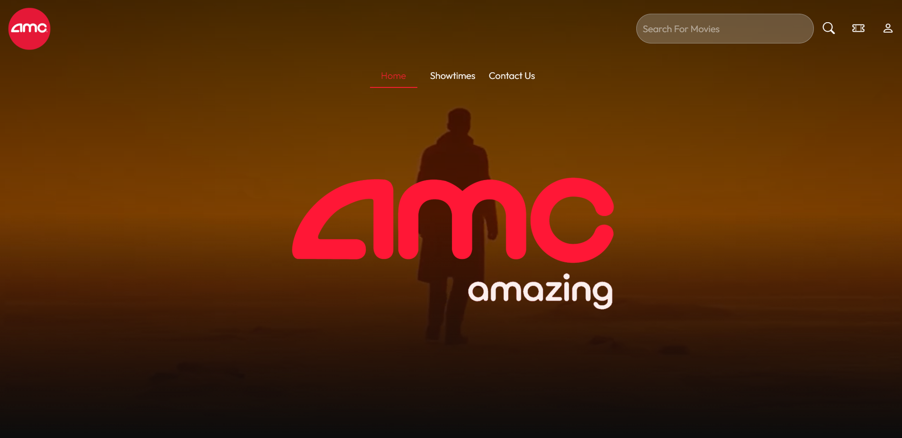 
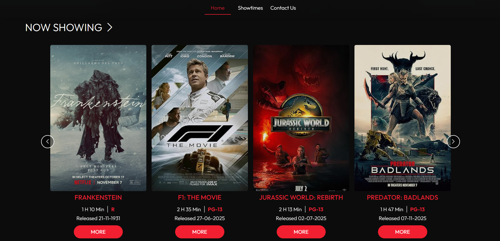 
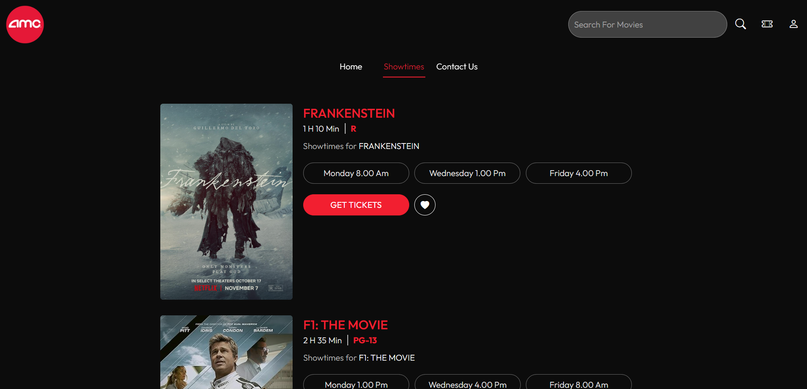 
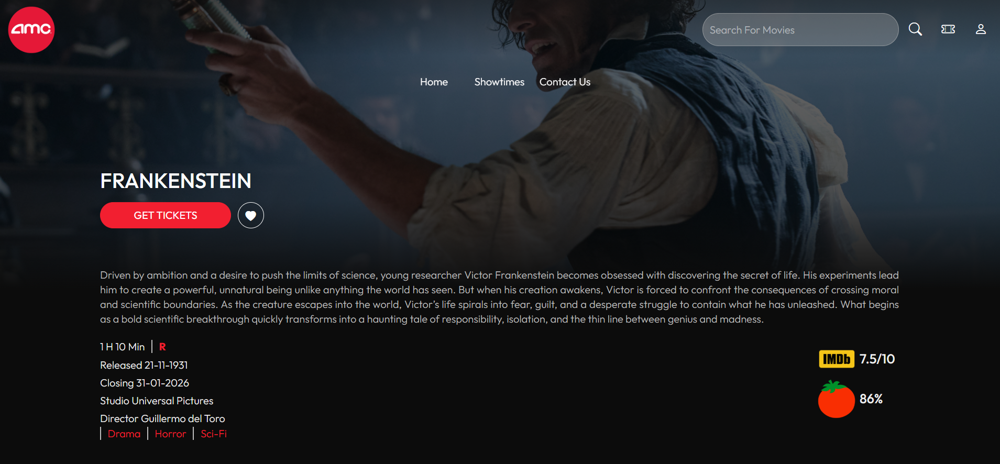 
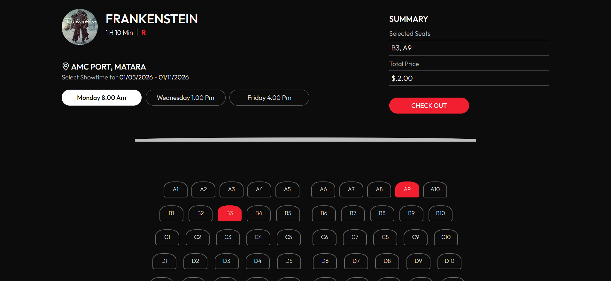 
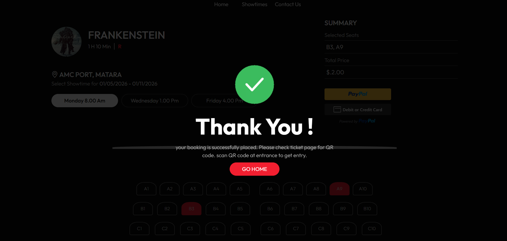 
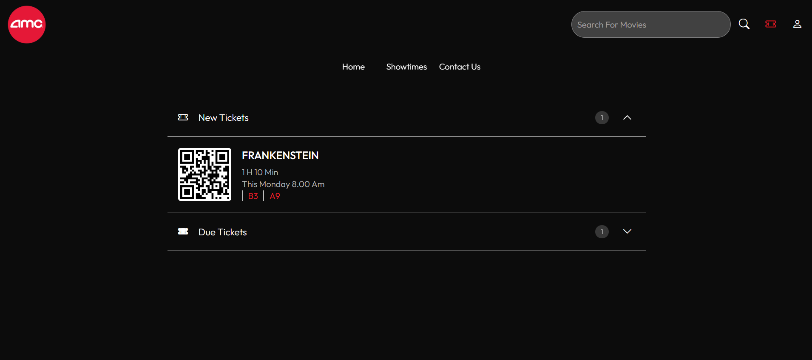 
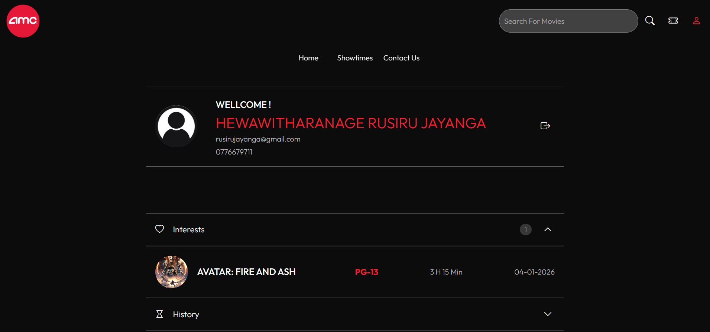 
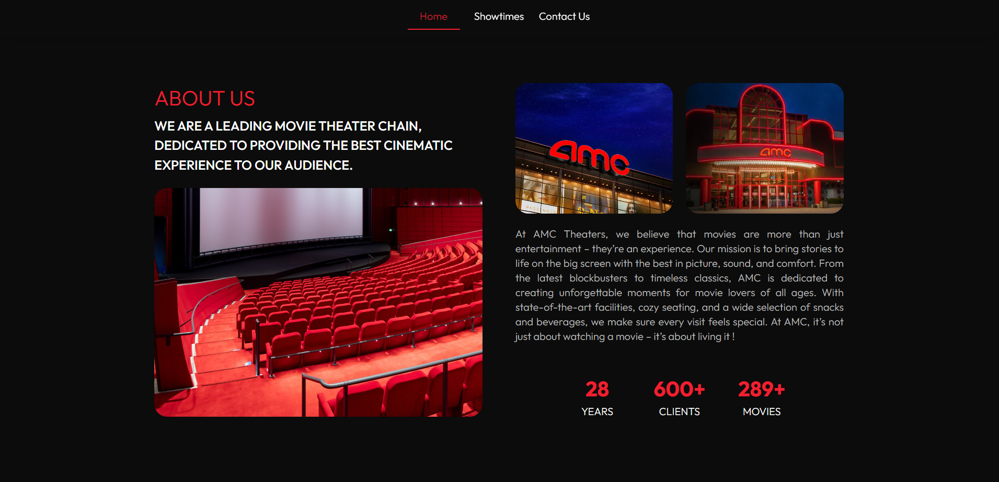 
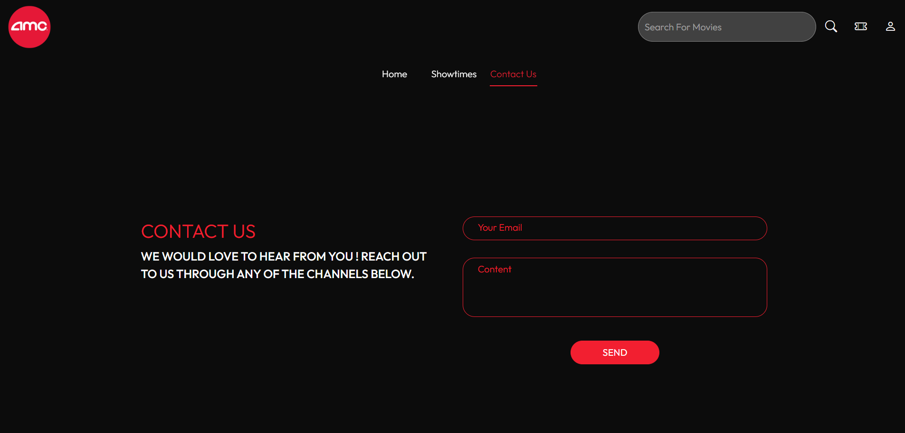 
 
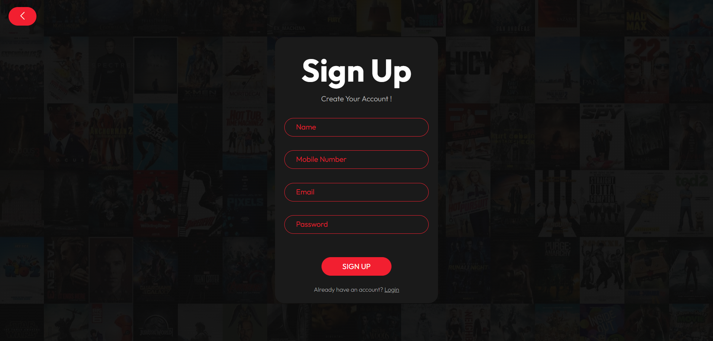 
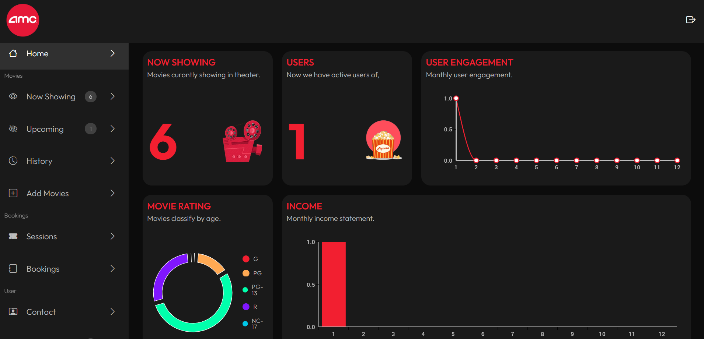 
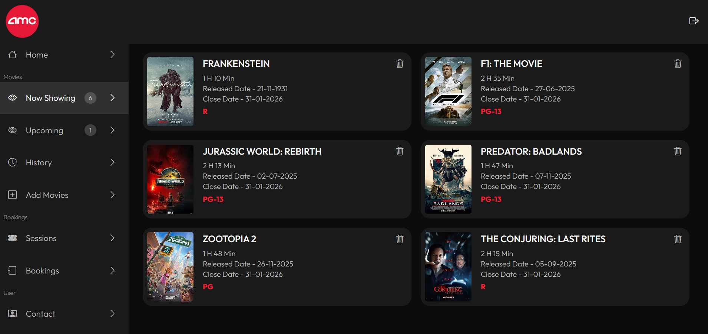 
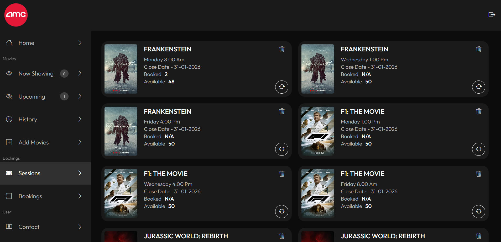 
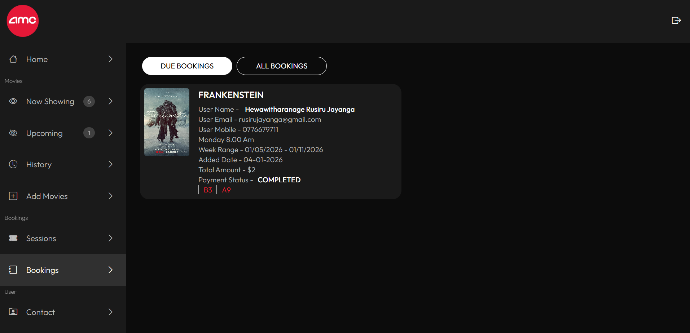
